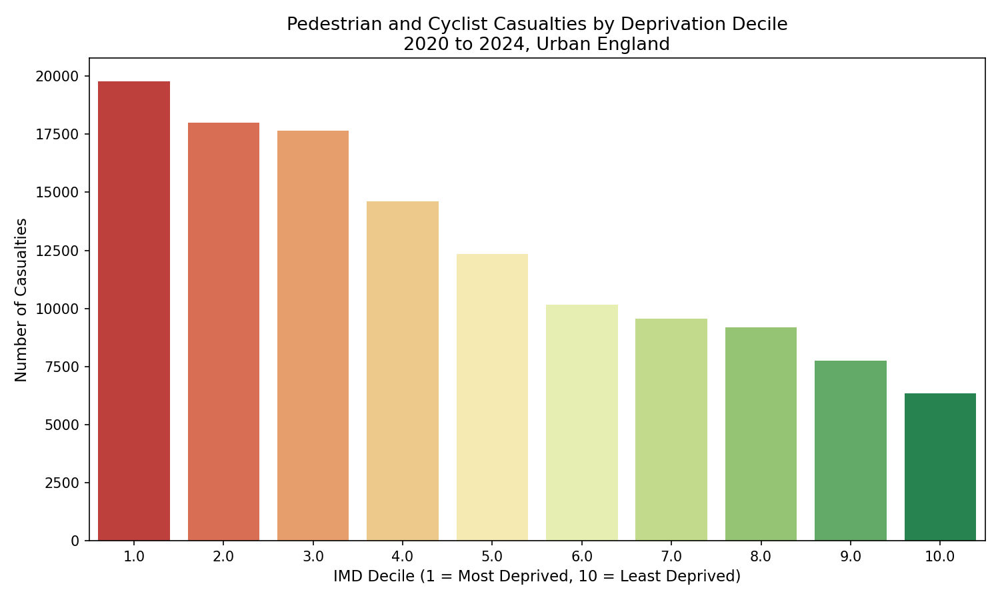
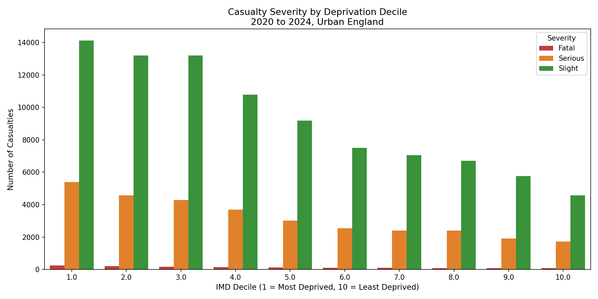
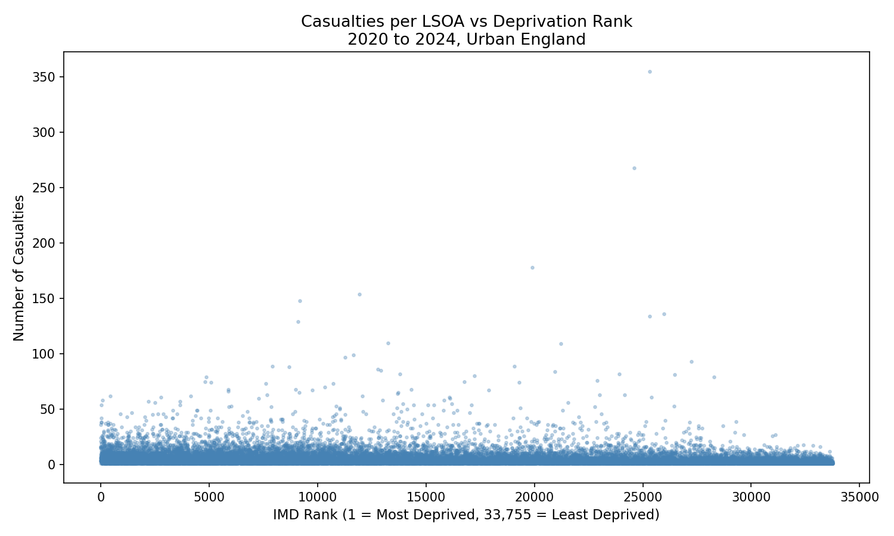
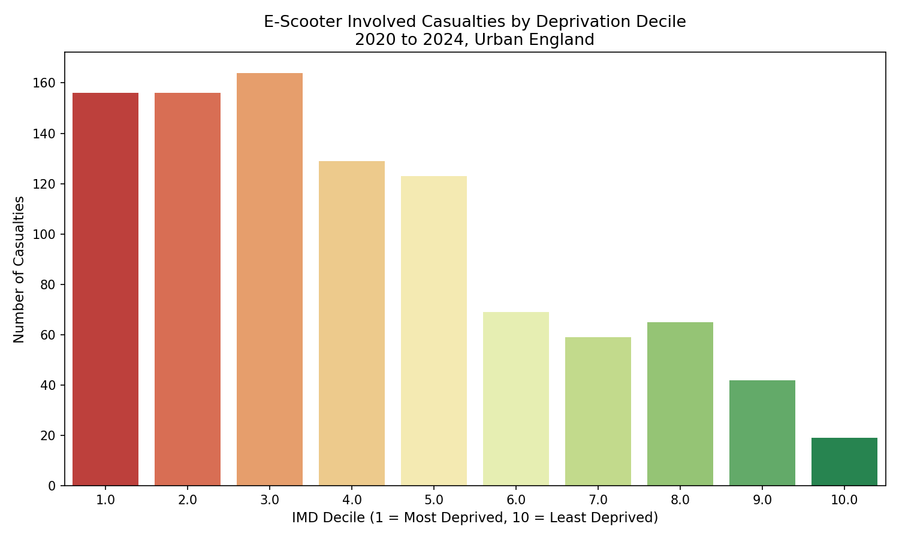

# Micromobility Safety and Deprivation in Urban England

A spatial data analysis project examining whether pedestrian and cyclist casualties 
cluster in more deprived urban neighbourhoods across England, and whether e-scooter 
trial areas exhibit distinct casualty patterns.

---

## Research Question

Do pedestrian and cyclist road casualties disproportionately affect residents of 
deprived urban neighbourhoods in England — and does e-scooter involvement amplify 
this inequality?

---

## Key Findings

- **125,443** urban pedestrian and cyclist casualties recorded across England, 2020–2024.
- Casualties in the **most deprived decile (IMD 1)** were approximately **three times higher** 
  than in the least deprived decile (IMD 10): 19,874 vs 6,419 casualties.
- A statistically significant negative correlation was identified between deprivation 
  rank and casualty count at LSOA level (**Spearman r = −0.226, p < 0.001**, n = 23,412 LSOAs).
- E-scooter involved casualties showed a **sharper deprivation gradient** than overall 
  casualties — the most deprived decile recorded **eight times more** e-scooter casualties 
  than the least deprived (156 vs 19).
- Fatal and serious casualties follow the same deprivation gradient as slight casualties, 
  indicating that deprived areas face disproportionate risk at every severity level.

---

## Policy Implication

Pedestrian and micromobility safety risk is not distributed equally across urban England. 
Neighbourhoods in the most deprived decile consistently experience the highest casualty 
burden. Any regulatory or infrastructure intervention targeting e-scooters or pedestrian 
safety should prioritise the most deprived urban areas to avoid widening existing 
inequalities in road safety outcomes.

---

## Data Sources

| Dataset | Source | Coverage |
|---|---|---|
| STATS19 Road Casualty Data | Department for Transport, data.gov.uk | 2020–2024 |
| Index of Multiple Deprivation 2025 | Ministry of Housing, Communities and Local Government | England, LSOA level |
| LSOA Boundaries 2021 | Office for National Statistics Geoportal | England and Wales |

---

## Methodology

### Data Pipeline

1. Loaded three STATS19 files — collisions, casualties, and vehicles — covering 503,475 
   collisions and 640,522 casualties across 2020–2024.
2. Filtered casualties to pedestrians (casualty_type = 0) and cyclists (casualty_type = 1) only.
3. Merged casualties with collision records to obtain geographic coordinates, severity, 
   LSOA of accident location, and road conditions.
4. Extracted e-scooter involvement flag from the vehicles file and joined to the master dataset.
5. Filtered to urban areas only (urban_or_rural_area = 1).
6. Joined IMD 2025 deprivation rank and decile at LSOA level using the accident location LSOA code.
7. Dropped 16,546 records where LSOA codes could not be matched due to boundary changes 
   between the 2011 and 2021 LSOA editions.

### Final Dataset

- **Rows:** 125,443
- **Columns:** 39
- **Geographic unit:** LSOA (Lower Layer Super Output Area)
- **Years:** 2020, 2021, 2022, 2023, 2024

### Known Limitations

- 16,546 casualty records (11.6%) were excluded due to LSOA boundary mismatches between 
  STATS19 data and IMD 2025. This may introduce minor geographic bias if exclusions are 
  spatially non-random.
- LSOA boundaries are represented as centroids rather than polygons due to the use of a 
  CSV boundary file. A full shapefile would improve the choropleth map accuracy.
- Casualty counts are not normalised by population or pedestrian exposure, which may 
  overstate risk in high-footfall urban LSOAs regardless of deprivation level.

---

## Visualisations

### Fig 1 — Casualties by Deprivation Decile


### Fig 2 — Severity by Deprivation Decile


### Fig 3 — Casualties per LSOA vs Deprivation Rank


### Fig 4 — E-Scooter Casualties by Deprivation Decile


---

## Repository Structure

```text
micromobility-safety-deprivation-uk/
├── dataset/                        # Raw data files (not tracked by git)
├── data/
│   └── processed/                  # Cleaned and merged datasets
├── outputs/
│   └── figures/                    # All generated charts and maps
├── notebooks/
│   ├── 01_clean_stats19.ipynb      # Data loading and cleaning
│   └── 02_load_imd_lsoa.ipynb      # IMD join and visualisations
└── README.md
```

---

## Tools and Libraries

- **Python 3.9** — pandas, numpy, geopandas, matplotlib, seaborn, scipy
- **Spatial analysis** — GeoPandas, Shapely
- **Statistical testing** — Spearman rank correlation (scipy.stats)
- **Data sources** — Department for Transport, ONS, MHCLG

---

## Author

Dhruv Jani  
BSc Data Science, Nottingham Trent University  
[github.com/Dhruvjani3003](https://github.com/Dhruvjani3003)  
[linkedin.com/in/jani-dhruv-b99960253](https://linkedin.com/in/jani-dhruv-b99960253)
